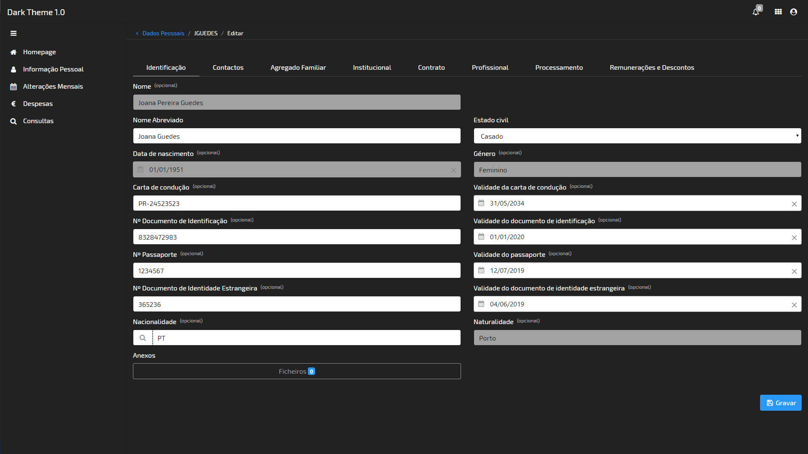

# Dark Theme 1.0

This theme is a dark mode version of the OMNIA default theme.

## Look & Feel

## Adding and Editing Themes

Here's all you need to know to add new themes, or edit existing ones: [https://docs.omnialowcode.com/](https://docs.omnialowcode.com/omnia3_modeler_themes.html).
